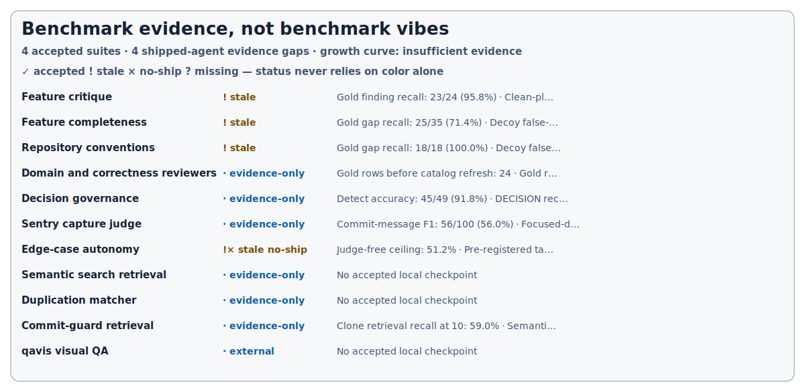

# @norvalbv/devkit

A versioned developer toolkit that keeps agent instructions, project conventions, and commit-time governance in one place. devkit ships reusable agent skills alongside the code that installs and enforces them, so consumer repositories do not have to maintain two drifting systems.

> This repository is presented for external inspection and use, but its package metadata remains private. It does not currently include project-level licensing or contribution-policy files.

## What devkit provides

| Surface | Purpose | Delivered as |
| --- | --- | --- |
| Agent skills and reviewers | Repeatable security, performance, correctness, testing, conventions, and workflow guidance | `skills/` and `agents/`, copied by `devkit init` or sync commands |
| Shared configuration | Biome and strict TypeScript presets for common stacks | Stable package export paths |
| Portable gate engine | Decision, review, duplication, structure, size, fan-out, Sentry, and advisory gates | `guard-*` command-line tools |
| Repository setup | Stack detection, idempotent installation, upgrades, diagnostics, and cleanup | The `devkit` CLI |

The package and agent assets use the same release tag. A prompt or skill cannot silently drift away from the installer and gate implementation that consumes it.

## Prerequisites

- Git
- [Bun](https://bun.sh/) for installation and repository development
- Node.js 23.6 or newer when running the emitted JavaScript directly
- A supported agent host when using the optional Claude/Cursor agent surfaces

## Quick start

Install a released tag into a consumer repository:

```bash
bun add -D git+https://github.com/norvalbv/devkit.git#<release-tag>
bunx devkit init
bunx devkit doctor
```

`devkit init` detects the current stack, lets you choose components and gates, writes the selected assets, and records that selection in `.devkit/config.json`. Use `--yes` for defaults or `--dry-run` to preview.

Extend the stable, extension-free package exports:

```jsonc
// biome.jsonc
{ "extends": ["@norvalbv/devkit/biome/base"] }

// tsconfig.json
{ "extends": "@norvalbv/devkit/tsconfig/base" }
```

## Operating modes

| Mode | Installation | Best fit |
| --- | --- | --- |
| Package | Git dependency plus generated repository assets | Repositories that can commit devkit configuration |
| Standalone | Globally installed CLI; no package dependency | Shared or work repositories where a private dependency is unsuitable |
| Overlay | Git-ignored local assets that chain to existing hooks/config | Repositories you cannot modify |

Package mode is the default. Standalone gates fail open when the pinned global CLI is unavailable, so CI and contributors must install the same release. Overlay mode is intentionally local and invisible to the host repository.

## Core commands

| Command | Outcome |
| --- | --- |
| `devkit init` | Detect and install selected components |
| `devkit doctor` | Report configuration, hook, skill, and agent drift |
| `devkit doctor --fix` | Re-run the recorded installation idempotently |
| `devkit upgrade` | Re-pin and reconcile configs, assets, hooks, and gates |
| `devkit sync-skills` / `sync-agents` | Refresh only the selected agent surfaces |
| `devkit move` | Move source files and rewrite imports safely |
| `devkit ship` | Commit from an isolated worktree and run the configured gate chain |
| `devkit reconcile` | Refresh a shared checkout after shipped work merges |
| `devkit clean` | Remove the recorded installation |

Run `devkit help` for the command index and `devkit help <command>` for authoritative options.

## Governance capabilities

- Append-only architectural decisions and scope-aware alignment checks
- Domain and correctness reviewer gates over staged changes
- Semantic duplication and token-clone detection
- Folder fan-out, source-size, and project-structure ratchets
- Deterministic gate checkpointing for safe ship retries
- Sentry-capture review for swallowed runtime failures
- Optional qavis advisory routing for UI changes

Every path the engine touches resolves from the consumer repository’s working directory. devkit ships mechanisms, not a consumer’s baselines, allowlists, decision history, or `guard.config.json`.

## Benchmark evidence

The dashboard below is generated from an append-only event ledger and immutable, sanitized checkpoints. The Markdown tables are the complete text alternative for the visual.

<!-- benchmark-dashboard:start -->
<picture>
  <source media="(prefers-color-scheme: dark)" srcset="docs/benchmarks/assets/dashboard-dark.svg">
  <source media="(prefers-color-scheme: light)" srcset="docs/benchmarks/assets/dashboard-light.svg">
  
</picture>

The tracker separates lifecycle, evidence provenance, freshness, change type, and assessment. A stale score remains visible but is never presented as current. Current history is too sparse and heterogeneous to support exponential-growth or diminishing-return claims; the honest classification is **insufficient comparable evidence**.

| Suite | Lifecycle | Evidence | Freshness | Change | Assessment | Latest evidence |
| --- | --- | --- | --- | --- | --- | --- |
| Feature critique | shipped | accepted | stale | quality | ↑ improved | Gold finding recall: 23/24 (95.8%) · Clean-plan pass rate: 4/5 (80.0%) |
| Feature completeness | shipped | accepted | stale | methodology-reset | ? unknown | Gold gap recall: 25/35 (71.4%) · Decoy false-flag rate: 2/27 (7.4%) |
| Repository conventions | shipped | accepted | stale | quality | ? unknown | Gold gap recall: 18/18 (100.0%) · Decoy false-flag rate: 1/14 (7.1%) |
| Domain and correctness reviewers | shipped | evidence-only | unknown | coverage | → flat | Gold rows before catalog refresh: 24 · Gold rows after catalog refresh: 29 |
| Decision governance | shipped | evidence-only | unknown | quality | ↑ improved | Detect accuracy: 45/49 (91.8%) · DECISION recall: 8/9 (88.9%) |
| Sentry capture judge | shipped | evidence-only | unknown | quality | ↑ improved | Commit-message F1: 56/100 (56.0%) · Focused-diff F1: 87/100 (87.0%) |
| Edge-case autonomy | no-ship | accepted | stale | no-ship | ? unknown | Judge-free ceiling: 51.2% · Pre-registered target: 35.0% |
| Semantic search retrieval | experimental | evidence-only | unknown | — | ? unknown | No accepted local checkpoint |
| Duplication matcher | shipped | evidence-only | unknown | — | ? unknown | No accepted local checkpoint |
| Commit-guard retrieval | shipped | evidence-only | unknown | quality | ? unknown | Clone retrieval recall at 10: 59.0% · Semantic retrieval recall at 10: 25.0% |
| qavis visual QA | shipped | external-required | unknown | — | ? unknown | No accepted local checkpoint |

### Shipped-agent coverage

| Shipped agent | Lifecycle | Evidence mode | Suite(s) |
| --- | --- | --- | --- |
| API security agent | shipped | evidence-only | reviewer-fleet |
| Backend performance agent | shipped | evidence-only | reviewer-fleet |
| Commit guard agent | shipped | evidence-only | commit-guard-retrieval |
| Conventions agent | shipped | accepted | conventions |
| Correctness agent | shipped | evidence-only | reviewer-fleet |
| Feature completeness agent | shipped | accepted | completeness |
| Feature critique agent | shipped | accepted | critique |
| Upstream-fix agent | shipped | none | — |
| Frontend accessibility agent | shipped | none | — |
| Frontend performance agent | shipped | evidence-only | reviewer-fleet |
| Frontend security agent | shipped | evidence-only | reviewer-fleet |
| Testing agent | shipped | none | — |
| Testing reviewer agent | shipped | none | — |

[Methodology, immutable checkpoints, full subject inventory, and provenance audit](docs/benchmarks/README.md)
<!-- benchmark-dashboard:end -->

## Known limitations

- LLM benchmarks consume real tokens and never run in CI. CI validates published evidence and generated views without making model or network calls.
- Several shipped agents and deterministic tools do not yet have an accepted benchmark. They remain visible as evidence gaps rather than being counted as covered.
- A changed implementation, corpus, scorer, or runner hash makes the prior score stale until a suite adapter accepts a new checkpoint.
- External systems such as qavis retain their own evidence; the local catalog marks them `external-required`.
- The package is installed from Git releases rather than a public package registry.

## Developing this repository

```bash
bun install --frozen-lockfile
bun run test:run
bun run typecheck
bun run lint
bun run lint:structure
bun run benchmarks:check
```

Benchmark tracker development additionally uses `bun run benchmarks:typecheck`. Release builds compile `.mts` sources into `dist/`; day-to-day changes should not hand-edit generated `dist` files.

## Documentation

- [Benchmark methodology and immutable history](docs/benchmarks/README.md)
- [Glossary and operating modes](docs/glossary.md)
- [Troubleshooting](docs/troubleshooting.md)
- [Structure governance](docs/structure-governance.md)
- [Directory structure](docs/directory-structure.md)
- [Architectural decision index](docs/decisions/INDEX.md)
